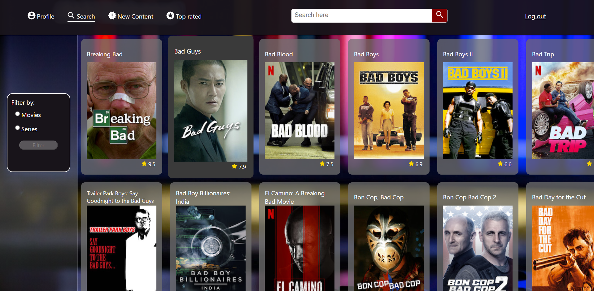

# Installatiehandleiding

## Inhoudsopgave

1. Inleiding
2. Lijst van benodigdheden
3. Installatiehandleiding
4. Beschikbare NPM-commando's
5. Bronvermelding

## 1. Inleiding

Deze applicatie geeft toegang tot de Netflix-database. Het doel van de applicatie is om een objectiever beeld te schetsen van de kwaliteit van de films en series die Netflix aanbiedt, waarbij de IMDb-ratings als kwaliteitscriterium worden gehanteerd. Daarnaast is het zoeksysteem van Netflix uitgebreid met de mogelijkheid om de aangeboden content op andere locaties ter wereld te doorzoeken. Je kunt via de zoekpagina naar titels zoeken en daarnaast kun je de meest recent toegevoegde titels vinden, evenals de titels met de hoogste IMDb-ratings.

Dit project is opgezet met [Create React App](https://github.com/facebook/create-react-app).

## 2. Lijst van benodigdheden

### Software

Gebruik een geschikte IDE naar keuze om de code te runnen, zoals Webstorm, IntelliJ of Visual Studio Code.

### API-key

Om de applicatie te gebruiken, heb je een API-key nodig. Deze kun je aanvragen op de volgende website:
https://rapidapi.com/unogs/api/unogsng. Maak vervolgens een .env-bestand aan in de scr-map en plaats daar de API-key onder de naam REACT_APP_API_KEY.

Als je toegang hebt tot de broncode, kun je de API-key van de ontwikkelaar gebruiken in het .env-bestand in de src-map.

### Node.js en NPM

Download: https://nodejs.org/en/download.

## 3. Installatiehandleiding

### Applicatie installeren

Als je het project gecloned hebt, installeer je de node_modules met behulp van het volgende commando in de terminal:

`npm install`

Vervolgens kun je de applicatie starten met behulp van het commando:

`npm start`

Open http://localhost:3000 om de pagina in de browser te bekijken.

### Applicatie starten

Om de applicatie te starten, zul je je eerst moeten registreren met een e-mailadres, gebruikersnaam en wachtwoord. Het registratieproces kan de eerste keer even duren. Let op: als je 30 minuten niet actief bent geweest wordt de database automatisch geleegd. Registreer je in dat geval opnieuw.

Na registratie kun je inloggen op de inlogpagina met je gebruikersnaam en wachtwoord. Vul hier ook de gewenste locatie in.

## 4. Beschikbare NPM-commando's 

### `npm start`

Start de applicatie.

Als je wijzigingen maakt in de code zal de pagina herladen. 

### `npm test`

Voert de unit tests uit.

### `npm run build`

Optimaliseert de `build`-map voor een optimale uitvoering van de applicatie.

Bekijk de [React-documentatie](https://reactjs.org/) voor meer informatie.

## 5. Bronvermelding
- Achtergrondafbeelding: https://unsplash.com/

