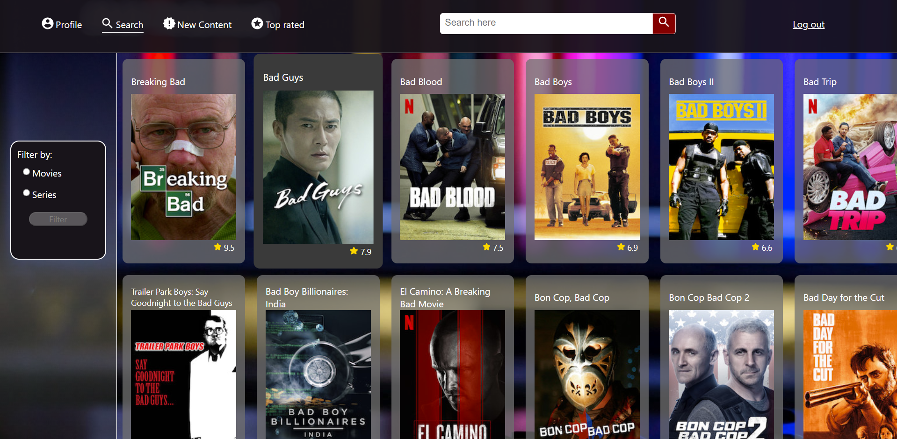

# Installatiehandleiding

## Inleiding

Deze applicatie geeft toegang tot de Netflix-database.
Je kunt via de zoekpagina naar titels zoeken en daarnaast kun je de meest recent toegevoegde titels vinden, evenals de titels met de hoogste IMDb-ratings.

Dit project is opgezet met [Create React App](https://github.com/facebook/create-react-app).

## Applicatie installeren

Als je het project gecloned hebt, installeer je de node_modules met behulp van het volgende commando in de terminal:

`npm install`

Vervolgens kun je de applicatie starten met behulp van het commando:

`npm start`

Of gebruik de WebStorm-knop (npm start). Open http://localhost:3000 om de pagina in de browser te bekijken.

## Applicatie starten

Om de applicatie te starten, zul je je eerst moeten registreren met een e-mailadres, gebruikersnaam en wachtwoord. Het registratieproces kan de eerste keer even duren. Let op: als je 30 minuten niet actief bent geweest wordt de database automatisch geleegd. Registreer je in dat geval opnieuw.

Na registratie kun je inloggen op de inlogpagina met je gebruikersnaam en wachtwoord. Vul hier ook de locatie in waarvan je de Netflix-database wilt zien.

## Applicatie gebruiken

Om de applicatie te gebruiken, heb je een API-key nodig. Deze kun je aanvragen op de volgende website:
https://rapidapi.com/unogs/api/unogsng.

Als je toegang hebt tot de broncode, kun je ook de API-key gebruiken in het .env-bestand in de src-map. Of neem contact op met de ontwikkelaar.

## Available Scripts

In the project directory, you can run:

### `npm start`

Runs the app in the development mode.\
Open [http://localhost:3000](http://localhost:3000) to view it in the browser.

The page will reload if you make edits.\
You will also see any lint errors in the console.

### `npm test`

Launches the test runner in the interactive watch mode.\
See the section about [running tests](https://facebook.github.io/create-react-app/docs/running-tests) for more information.

### `npm run build`

Builds the app for production to the `build` folder.\
It correctly bundles React in production mode and optimizes the build for the best performance.

The build is minified and the filenames include the hashes.\
Your app is ready to be deployed!

See the section about [deployment](https://facebook.github.io/create-react-app/docs/deployment) for more information.

## Learn More

You can learn more in the [Create React App documentation](https://facebook.github.io/create-react-app/docs/getting-started).

To learn React, check out the [React documentation](https://reactjs.org/).

